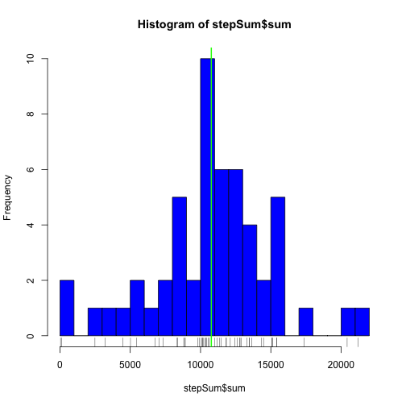
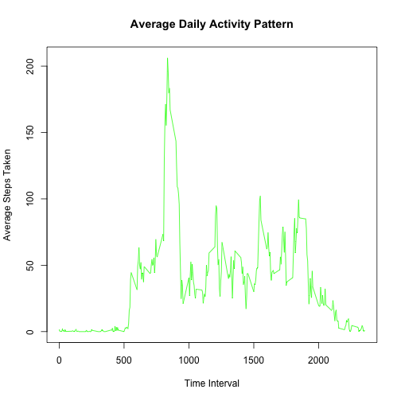
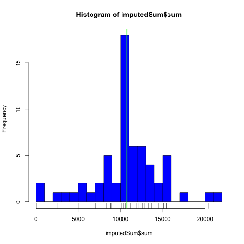
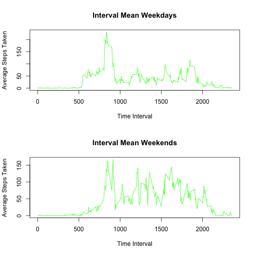

# Reproducible Research - Week 1 Project  
Shayne Easterwood  

## Introduction  

The purpose of this project is to analyze some data acquired from an activity monitoring device, according to the instructions provided in the assignment. 

The dataset was downloaded from the course website at https://d396qusza40orc.cloudfront.net/repdata%2Fdata%2Factivity.zip.

This data contains the following variables:
1. steps: Number of steps taken in a 5-minute interval (missing values are coded as NA)
2. date: The date on which the measurement was taken in YYY-MM-DD format. 
3. interval: Identifier for the 5-minute interval in which the measurement was taken. 

There are a total of 17,568 observations. 

## Project Analysis Requirements  

### 1. Loading and Preprocessing Data

The first step was to load and pre-process the data. The data was downloaded from the link below, and unzipped into a local folder, first. The working directory was then set to the local folder. 
After loading the data, and taking a look at the structure, the only preprocessing required was to convert the date to POSIX format. 

Here is the code used to load the data and convert the date:


```r
rawData <- read.csv("activity.csv")
library(lubridate)
library(dplyr)
```

```
## 
## Attaching package: 'dplyr'
```

```
## The following objects are masked from 'package:lubridate':
## 
##     intersect, setdiff, union
```

```
## The following objects are masked from 'package:stats':
## 
##     filter, lag
```

```
## The following objects are masked from 'package:base':
## 
##     intersect, setdiff, setequal, union
```

```r
dataDate <- mutate(rawData, date = ymd(rawData$date))
```

### 2. What is the mean total number of steps taken per day?  

For this requirement, the first step is to calculate the total number of steps taken per day.
To do this, the data was subsetted to exlude the interval column (since it wasn't needed for this calculation) and to remove the NA values, then grouped by date. The summarize() function was then used to create a new data set with the sum of the steps by day. Here is the code used for these calculations:


```r
dataNoInterval <- select(dataDate, -interval)
dataNoInterval <- filter(dataNoInterval, steps != "NA")
dataByDate <- group_by(dataNoInterval, date)
stepSum <- summarize(dataByDate, sum = sum(steps))
```

The second step for this requirement is to create a histogram of the total number of steps taken each day, and to calculate the mean and median of the total number of steps taken per day. 

Here is the code and histogram, including calculation of the mean and median:


```r
hist(stepSum$sum, col = "blue", breaks = 20)
rug(stepSum$sum)
stepsMean <- mean(stepSum$sum)
stepsMedian <- median(stepSum$sum)
abline(v = stepsMean, col = "green", lwd = 2)
```



Here is the ouput of the mean and median:


```r
stepsMean
```

```
## [1] 10766.19
```

```r
stepsMedian
```

```
## [1] 10765
```

### 3. What is the average daily activity pattern?

The first step for this requirement was to make a time series plot of the 5-minute intervals and the number of steps taken, averaged across all days. To do this, the original data set with converted date was used, and re-grouped according to interval. Then, the summarize() function was used to create a new data set with the average steps taken for each 5-minute interval, across all days. That new data set was then used to do the time series plot described above. Here is the code and plot:


```r
dataDailyActivity <- group_by(dataDate, interval)
dailyActivityMean <- summarize(dataDailyActivity, average_interval = mean(steps, na.rm = TRUE))
plot(dailyActivityMean$interval, dailyActivityMean$average_interval, type = "l", col = "green", 
     main = "Average Daily Activity Pattern", xlab = "Time Interval", ylab = "Average Steps Taken")
```



The next step was to determine the 5-minute interval, with the maximum number of steps, on average. To do this, the data set with the averages by 5-minute intervals, was arranged based on the average number of steps, in descending order. Then by viewing the first row, the 5-minute interval in question, as well as the average number of steps, can be determined. Here is the code and results:


```r
arrangedDailyActivity <- arrange(dailyActivityMean, desc(average_interval))
arrangedDailyActivity[1,]
```

```
## Source: local data frame [1 x 2]
## 
##   interval average_interval
##      (int)            (dbl)
## 1      835         206.1698
```

### 4. Imputing Missing Values

The first step for this requirement is to calculate the total number of NA values in the original data set. Here is the code and the result:


```r
sum(is.na(dataDate$steps))
```

```
## [1] 2304
```

The second step for this requirement was to determine a methodology for filling in the missing values in the original data set. The simple mean substitution method was used, which replaced each NA value with the mean value for that interval across all days. Here is the code used for imputing the data:


```r
imputedData <- transform(dataDate, steps = ifelse(is.na(steps), dailyActivityMean$average_interval, steps))
groupedImputedData <- group_by(imputedData, date)
imputedSum <- summarize(groupedImputedData, sum = sum(steps))
```

The third step for this requirement was to create a histogram of the total number of steps taken each day, along with calculating the mean and median. Here is the code and the histogram:


```r
hist(imputedSum$sum, col = "blue", breaks = 20)
rug(imputedSum$sum)
stepsMean2 <- mean(imputedSum$sum)
stepsMedian2 <- median(imputedSum$sum)
abline(v = stepsMean2, col = "green", lwd = 2)
```



Here is the calculated mean and median of this new imputed data set. 


```r
stepsMean2
```

```
## [1] 10766.19
```


```r
stepsMedian2
```

```
## [1] 10766.19
```

As you can see, the mean for both data sets was exactly the same at 10766.19. 
The median for the imputed data set moved from 10765 to match the mean at 10766.19. This is to be expected 
as the NA values were replaced with the mean values. 

If we recalcuated the total daily number of steps using the imputed data, we would see an increase in those numbers, due to the replaced NA values increasing the sum. 

### 5. Are there differences in activity patterns between weekdays and weekends?

The first step for this requirement was the create a new factor variable of the date, with 2 levels - weekday and weekend. 

To do this, first the weekday was added as a separate column to the data set containing the imputed data. Then each weekday day, was converted to just "weekday", while the two weekend days were converted to "weekend". 

Here is the code for those steps (*The author realizes this is not the most efficient or elegant means to create the factor variables required, but she had tired-head, and this was what she went with*):


```r
weekdayData <- mutate(imputedData, weekday = weekdays(imputedData$date, abbreviate = FALSE))
weekdayData$weekday[weekdayData$weekday == "Monday"] <- "weekday"
weekdayData$weekday[weekdayData$weekday == "Tuesday"] <- "weekday"
weekdayData$weekday[weekdayData$weekday == "Wednesday"] <- "weekday"
weekdayData$weekday[weekdayData$weekday == "Thursday"] <- "weekday"
weekdayData$weekday[weekdayData$weekday == "Friday"] <- "weekday"
weekdayData$weekday[weekdayData$weekday == "Saturday"] <- "weekend"
weekdayData$weekday[weekdayData$weekday == "Sunday"] <- "weekend"
```

The next step for this requirement was to create a panel plot containing a time series plot of the 5-minute interval and the average number of steps taken. To do this, two separate data sets were created - one for weekend data, and one for weekday data. Then each new data set was re-grouped by the interval, then summarize() was used again, to create a new data set with the average numbers of steps by interval. Then each of those data sets was used to create the two time series plots described above. 

Here is the code, and the panel plot:


```r
weekdays <- filter(weekdayData, weekday == "weekday")
weekends <- filter(weekdayData, weekday == "weekend") 
groupedWeekdays <- group_by(weekdays, interval)
meanWeekdays <- summarize(groupedWeekdays, average_interval = mean(steps))
groupedWeekends <- group_by(weekends, interval)
meanWeekends <- summarize(groupedWeekends, average_interval = mean(steps))
par(mfrow=c(2, 1))
plot(meanWeekdays$interval, meanWeekdays$average_interval, type = "l", col = "green", 
     main = "Interval Mean Weekdays", xlab = "Time Interval", ylab = "Average Steps Taken")
plot(meanWeekends$interval, meanWeekends$average_interval, type = "l", col = "green", 
     main = "Interval Mean Weekends", xlab = "Time Interval", ylab = "Average Steps Taken")
```



It is fairly clear that the majority of activity begins earlier in the day on both the Weekdays and the Weekends, though slightly later on the weekends. You can also see that a much higher level of activity is maintained throughout the day on the weekends, than on the weekdays. 

### End of project
